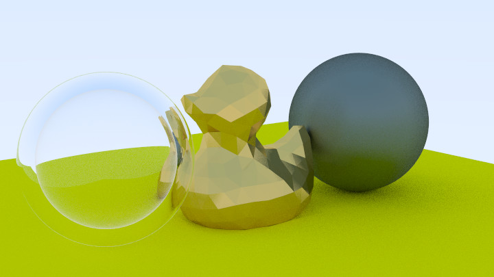

# Hermes GPU Ray Tracer
This project is a GPU-based ray tracer developed for the purpose of learning and exploring the fundamentals of ray tracing and CUDA. The implementation follows the book "Ray Tracing in a Weekend" by Peter Shirley, with some additional optimizations and features added. This project is a fork of my CPU-based ray tracer [cyclops-cpu-ray-tracer](https://github.com/t-dimitrov/cyclops-cpu-ray-tracer).



# Features
- **PPM file format**: The final image output is in a `ppm` file format which is short for [Portable PixMap](https://en.wikipedia.org/wiki/Netpbm). The `output.jpg` image has been converted in [GIMP](https://www.gimp.org/).
- Apart of the features mentioned in the CPU-based ray tracer, the GPU-based ray tracer uses CUDA to parallelize the ray calculations per pixel in order to achieve a massive speedup.

# Building and Running
## Prerequisites
- C++ Compiler (compatible with C++20 or later)
- CMake (version 3.29 or later)
- Visual Studio (2022 or later)

## Instructions
1. Clone the repository 
```pwsh
git clone https://github.com/t-dimitrov/hermes-gpu-ray-tracer
```
2. Build the project

If using Visual Studio, open the project by clicking `Open Local Folder`.

If building through cmake call
```pwsh
mkdir build
cd build
cmake ../
```
